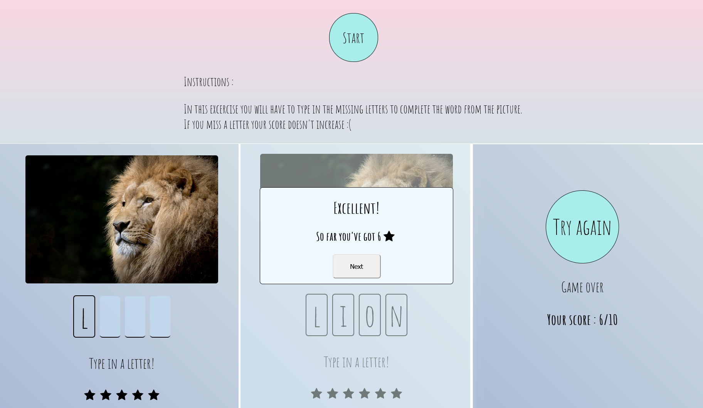

### About:
Simple game made in React.  
Objective is to guess all letters without making any mistakes. For each guess without misspell you get a star.  
Primary purpose was to practice React.  
If you like it :star: it.  
Enjoy :)

### Preview

Live version : [Typing app](https://max1mmus.github.io/typing-app-React/)

##### Source for images used in project: [Pexels](https://www.pexels.com/) (free stock photos)

### In the project directory run

### `npm start`

Runs the app in the development mode. 
Open [http://localhost:3000](http://localhost:3000) to view it in the browser.

The page will reload if you make edits. 
You will also see any lint errors in the console.

### Learn More

This project was bootstrapped with [Create React App](https://github.com/facebook/create-react-app).

You can learn more in the [Create React App documentation](https://facebook.github.io/create-react-app/docs/getting-started).

To learn React, check out the [React documentation](https://reactjs.org/).
